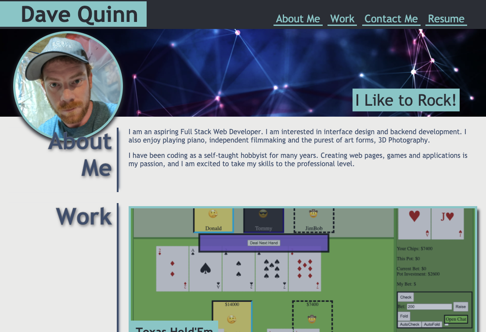

# Development Portfolio

This is a [Web Page](https://en.wikipedia.org/wiki/Web_page) to showcase my development portfolio, comprised of class projects and more personal ones. And one day, perhaps, even a professional project.

## Project Objectives
Meet all challenge criteria and Mock-Up objectives while relying on advanced CSS to accomplish site design and styling. I will also utilize media queries, flex-box and scaling elements to maintain a consistent look on all screen sizes. Support for Dark Mode will also be included with some more personal styling choices different from the mock-up.

Going against better practices, I will include many CSS animations and transitions to breathe some life and excitement into an otherwise perfectly fine looking website.


## Installation

Should load in all modern web browsers supporting HTML5 and CSS3. However, it is recommended to view using [Google Chrome](https://www.google.com/intl/en_ca/chrome/)

## Usage

```python
open https://qcent.github.io/dev-portfolio/

```
...or alternatively... \
Click this link https://qcent.github.io/dev-portfolio/ \
Once here:

move the mouse click around and read some things.

## Contributing
Pull requests are totally welcome. For major changes, please open an issue first to discuss what you would like to change. \
\* _Hint_ \* Only things that make me look good will be approved.

But please, please make sure to test as appropriate. I worked really hard on this, and you don't want to go and mess it up... Do You?

... and you better comment on every new line of CSS too!

## License
[MIT](https://choosealicense.com/licenses/mit/)

## Conclusion

> Only things that make me look good ... 

   -Me
